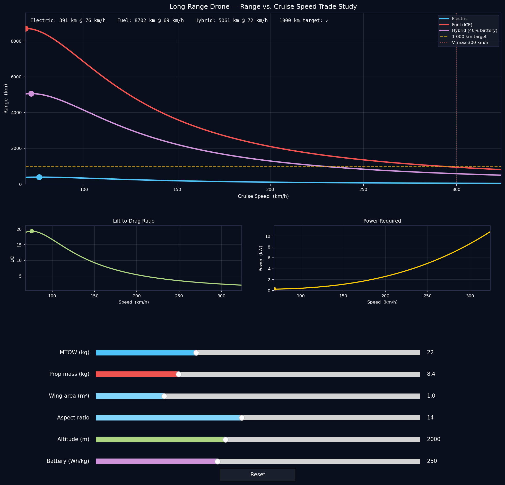

# Drone Range Trade Study

Interactive range vs. cruise speed trade study for a long-range fixed-wing drone — 1 000 km target range, 300 km/h max speed, ~1 kg payload (ETH Zürich ASL focus project).

Drag the sliders to explore how airframe geometry and propulsion choices shift the range envelope across three powertrain architectures.

---

## Demo



*Dots mark the best-range speed for each propulsion type. The dashed gold line is the 1 000 km target; the dotted red line is the 300 km/h speed requirement.*

---

## The Engineering Problem

Long range and high speed pull in opposite directions:

- Flying faster increases parasite drag quadratically, burning through energy reserves quickly
- Flying slower reduces parasite drag but increases induced drag
- The optimal cruise speed (minimum drag = maximum L/D) is set by the drag polar and wing geometry
- Propulsion type changes how much useful energy fits within the mass budget

---

## Physics Model

### Atmosphere

ISA troposphere (valid to ~11 km):

```
T(h) = 288.15 − 0.0065 · h
ρ(h) = 101325 · (T/288.15)^5.256 / (287.05 · T)
```

### Aerodynamics

Level, constant-altitude cruise with a parabolic drag polar:

```
CL = 2W / (ρ V² S)
CD = CD₀ + CL² / (π · AR · e)
D  = ½ ρ V² S · CD
```

| Symbol | Meaning | Default |
|--------|---------|---------|
| `CD₀` | Zero-lift (parasite) drag coefficient | 0.025 |
| `AR` | Wing aspect ratio | 14 |
| `e` | Oswald efficiency factor | 0.85 |
| `CLmax` | Maximum lift coefficient (sets stall speed) | 1.30 |

### Electric Range

Batteries don't lose mass, so weight — and drag — stay constant throughout cruise:

```
R_elec = (m_batt · ε_bat · η_e · η_prop) / D
```

| Symbol | Meaning | Value |
|--------|---------|-------|
| `m_batt` | Battery mass (80% of propulsion budget) | — |
| `ε_bat` | Battery specific energy | slider (Wh/kg) |
| `η_e` | Motor + ESC efficiency | 0.85 |
| `η_prop` | Propeller shaft-to-thrust efficiency | 0.85 |

Maximum range occurs at minimum drag speed (peak L/D).

### Fuel (ICE) Range — Breguet

As fuel burns the aircraft gets lighter, drag drops, and range extends beyond a simple E/D estimate. The propeller-aircraft Breguet equation captures this:

```
R_fuel = (η_f · H / g) · L/D_avg · ln(W_start / W_end)
```

| Symbol | Meaning | Value |
|--------|---------|-------|
| `η_f` | Overall fuel-to-thrust efficiency (η_thermal × η_prop) | 0.27 |
| `H` | Fuel lower heating value | 11 800 Wh/kg |
| `L/D_avg` | Average of start and end L/D (constant-speed approximation) | — |

Fuel mass = 85% of propulsion budget.

### Hybrid Range

Fuel-first then electric on the lighter airframe:

1. **Phase 1 (fuel):** Breguet on 60% of propulsion budget as fuel
2. **Phase 2 (electric):** E/D on 40% of propulsion budget as battery, computed at the reduced post-burn weight

### Shaft Power

```
P_shaft = D · V / η_prop   [kW]
```

Shown in the lower-right panel to indicate motor sizing requirements.

---

## Sliders

| Slider | Range | Effect |
|--------|-------|--------|
| MTOW | 5 – 60 kg | Total takeoff mass; scales weight, stall speed, and all range calculations |
| Prop mass | 1 – 30 kg | Mass budget allocated to energy storage + motors |
| Wing area S | 0.2 – 4.0 m² | Sets stall speed and the balance of parasite vs. induced drag |
| Aspect ratio AR | 5 – 25 | Higher AR → lower induced drag → more range, at the cost of structural weight |
| Altitude | 0 – 5 000 m | Lower density at altitude → higher TAS for the same lift → shifted drag curves |
| Battery (Wh/kg) | 100 – 500 | Energy density technology level (250 Wh/kg ≈ current state of art) |

---

## Model Assumptions

- Still-air cruise only — no climb, descent, wind, or reserves
- Constant altitude and airspeed throughout (no step climbs)
- Structural, avionics, and payload mass fixed at MTOW − prop mass (minimum 2 kg)
- CD₀, Oswald factor, and CLmax fixed (not yet sliders)

---

## Specifications (ETH ASL Focus Project)

| Parameter | Target |
|-----------|--------|
| Range | up to **1 000 km** |
| Max speed | up to **300 km/h** |
| Payload | ~**1 kg** (HD camera + sensors) |
| MTOW | ~**22 kg** |

---

## Installation

```bash
pip install matplotlib numpy
python main.py
```

Requires Python 3.9+ and a display (uses the macOS native Matplotlib backend; change `matplotlib.use('MacOSX')` to `'TkAgg'` or `'Qt5Agg'` on other platforms).

---

## Related

- [CATCHY — Drone Interception Simulation](https://github.com/jamietrounce/CATCHY-sim) — same visual style, explores guidance and sensing trade-offs for intercepting a rogue drone.
